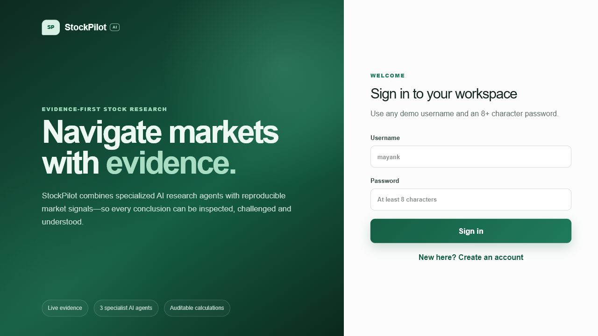
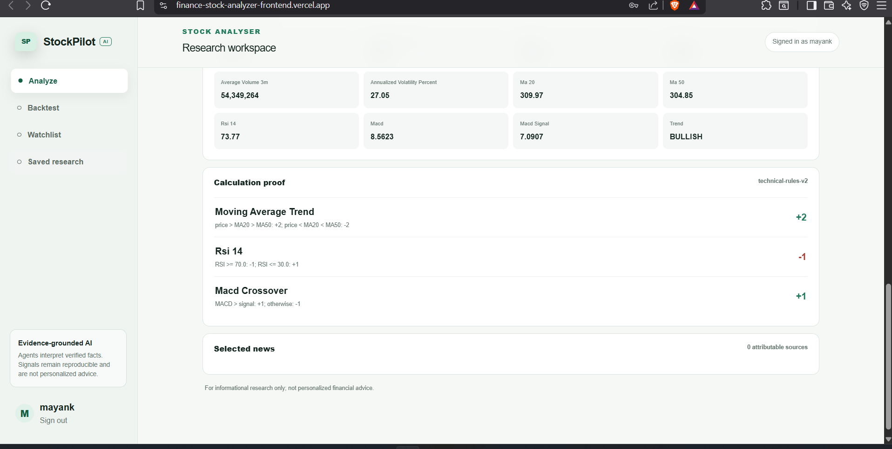
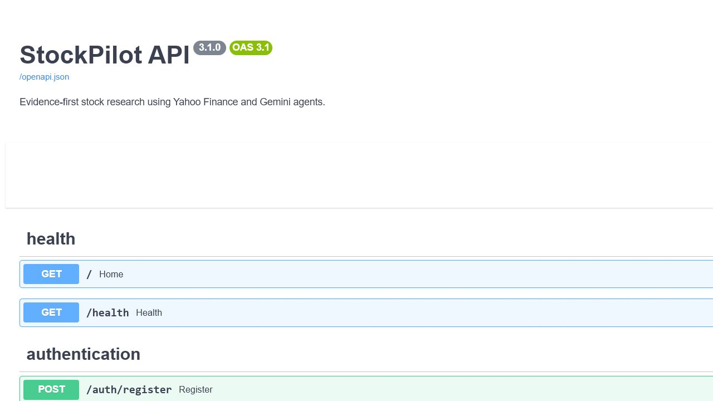
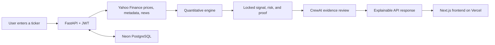

<div align="center">

# StockPilot API

### Evidence-grounded stock research with reproducible signals and constrained AI review

[](https://www.python.org/)
[](https://fastapi.tiangolo.com/)
[](https://www.crewai.com/)
[](https://neon.tech/)
[](https://www.docker.com/)
[](#testing)

[**Launch application**](https://stockpilot-analyzer.vercel.app) | [**Explore API**](https://finance-stock-analyzer.onrender.com/docs) | [**Check service health**](https://finance-stock-analyzer.onrender.com/health) | [**Frontend repository**](https://github.com/mayank2OP/finance-stock-analyzer-frontend)

</div>

StockPilot combines reproducible quantitative rules with constrained AI agents. Yahoo Finance supplies the market evidence, Python calculates the indicators and locks the signal, and CrewAI agents using Gemini select the most relevant supplied evidence. The LLM cannot change the calculated BUY/HOLD/SELL result or invent market numbers.

## Product tour

### 1. A focused, evidence-first entry point

The live product explains its promise before asking the user to sign in: specialist AI review, reproducible signals, and auditable calculations.

<p align="center">
  
</p>

### 2. Every decision remains inspectable

The research workspace shows market metrics and the exact score contribution of every rule instead of hiding the result behind an AI label.

<p align="center">
  
</p>

### 3. The complete API is documented and testable

FastAPI publishes an interactive OpenAPI contract for health, authentication, analysis, background jobs, backtesting, watchlists, and saved research.

<p align="center">
  
</p>

| 3 specialist agents | 27 automated tests | 5-minute evidence cache | 3 persistent portfolio features |
|:---:|:---:|:---:|:---:|
| Research, Risk, Advisor | Deterministic and isolated | Faster repeat analysis | Watchlist, analyses, backtests |

## Learning handbooks

New to the project or preparing for an interview? These illustrated guides explain the codebase from first principles.

| Guide | What it covers | Download |
|---|---|---|
| Backend handbook | FastAPI, indicators, scoring, CrewAI, JWT, PostgreSQL, backtesting, Docker, testing, and interview answers | [Open PDF](output/pdf/stockpilot-backend-learning-handbook.pdf) |
| Frontend handbook | Next.js, React state, authentication, polling, API integration, responsive UX, Vercel, CORS, and interview answers | [Open PDF](output/pdf/stockpilot-frontend-learning-handbook.pdf) |

## Why this project is trustworthy

- **Reproducible signals:** BUY/HOLD/SELL and risk are calculated from versioned rules, not generated by an LLM.
- **Calculation proof:** every response includes observed values, formulas, thresholds, score contributions, price window, and source metadata.
- **Constrained AI:** Research, Risk, and Advisor agents can select and summarize supplied evidence but cannot overwrite quantitative outputs.
- **Attributable news:** displayed articles require a real title, publisher, timestamp, and clickable source URL.
- **Honest confidence:** the evidence-quality score measures data completeness and review coverage—not the probability of profit.
- **Auditable backtesting:** signals are shifted one trading day to prevent look-ahead bias, transaction costs are included, and results are compared with buy-and-hold.

## Architecture



### Analysis lifecycle

1. Validate and normalize the ticker.
2. Collect adjusted price history, company metadata, and recent attributable news.
3. Calculate MA20, MA50, RSI(14), MACD, momentum, volume, and annualized volatility.
4. Apply versioned decision rules to lock the action and risk level.
5. Run Research and Risk agents in parallel; the Advisor agent selects the final explanation.
6. Return the narrative together with the underlying metrics, rule trace, source links, timestamp, and disclaimer.

## Features

- Synchronous and asynchronous stock analysis
- Explainable BUY, HOLD, and SELL signals
- Three-agent CrewAI review powered by Google Gemini
- Evidence-quality scoring and calculation trace
- News normalization across current Yahoo Finance formats
- Historical strategy backtesting with benchmark comparison
- JWT authentication with Argon2 password hashing
- Personal watchlists, saved analyses, and saved backtests
- PostgreSQL persistence through SQLAlchemy
- Per-user and per-IP rate limiting for free-tier protection
- Structured request logging and provider-safe error responses
- Docker-based production deployment

## Technology choices

| Technology | Purpose |
|---|---|
| FastAPI | Typed REST API and interactive OpenAPI documentation |
| Yahoo Finance / yfinance | Price history, metadata, and attributable news |
| pandas and NumPy | Indicator calculation and backtesting |
| CrewAI + Gemini | Constrained multi-agent evidence review and explanation |
| SQLAlchemy + PostgreSQL | Portable, persistent application data |
| JWT + Argon2 | Stateless authentication and secure password hashing |
| Docker + Render | Reproducible backend deployment |
| Neon | Managed serverless PostgreSQL |

## Main API endpoints

| Method | Endpoint | Purpose |
|---|---|---|
| `GET` | `/health` | API and database readiness |
| `POST` | `/auth/register` | Create an account |
| `POST` | `/auth/token` | Receive a JWT access token |
| `GET` | `/auth/me` | Read the current user |
| `POST` | `/analyze` | Run synchronous stock analysis |
| `POST` | `/analysis-jobs` | Start asynchronous agent analysis |
| `GET` | `/analysis-jobs/{job_id}` | Poll analysis progress |
| `POST` | `/backtest` | Run an evidence-based backtest |
| `GET/POST/DELETE` | `/watchlist` | Manage a personal watchlist |
| `GET/POST/DELETE` | `/saved-analyses` | Manage saved research |
| `GET/POST/DELETE` | `/saved-backtests` | Manage saved backtests |

The complete request and response schemas are available in the [live Swagger documentation](https://finance-stock-analyzer.onrender.com/docs).

## Run locally

### Prerequisites

- Python 3.11+
- A Gemini API key from [Google AI Studio](https://aistudio.google.com/apikey)

### Setup on Windows PowerShell

```powershell
git clone https://github.com/mayank2OP/finance-stock-analyzer.git
cd finance-stock-analyzer
python -m venv .venv
Set-ExecutionPolicy -Scope Process -ExecutionPolicy RemoteSigned
.\.venv\Scripts\Activate.ps1
pip install -r requirements.txt
Copy-Item .env.example .env
```

Add your own `GEMINI_API_KEY` and a long random `JWT_SECRET` to `.env`, then start the API:

```powershell
uvicorn stock_crew:app --reload
```

Open `http://127.0.0.1:8000/docs`. Local development uses SQLite by default and creates `stock_analyser.db` automatically.

## Environment variables

Use `.env.example` as the source of truth. Important production values are:

```env
APP_ENV=production
GEMINI_API_KEY=your_private_key
GEMINI_MODEL=gemini/gemini-3.5-flash-lite
JWT_SECRET=a_unique_random_value_at_least_32_characters_long
DATABASE_URL=your_private_neon_postgresql_connection_string
CORS_ORIGINS=https://stockpilot-analyzer.vercel.app
```

Never commit `.env`, API keys, JWT secrets, database credentials, access tokens, or local database files.

## Backtesting methodology

The backtester shares strategy thresholds with live analysis through `strategy_config.py`. Supported periods are `1y`, `2y`, `5y`, and `10y`.

- A signal is calculated using only information available at that date.
- The simulated position is shifted by one trading day before returns are applied.
- Transaction costs are charged whenever the position changes.
- Strategy results are compared with buy-and-hold over the same adjusted-price window.
- The response includes return, volatility, Sharpe ratio, maximum drawdown, exposure, signal counts, and forward hit rate.

Backtests are hypothetical and do not guarantee future performance.

## Testing

The test suite uses an isolated in-memory SQLite database and mocks external providers; it does not consume Gemini quota or write test data to the development database.

```powershell
python -m unittest discover -s tests -v
```

Current suite: **27 passing tests** covering analysis, authentication, authorization, portfolio persistence, backtesting, rate limits, database configuration, and asynchronous jobs.

## Deployment

- **Frontend:** Next.js on Vercel
- **Backend:** Docker web service on Render
- **Database:** PostgreSQL on Neon
- **AI provider:** Google Gemini

Render runs the Docker image on the platform-provided `PORT`. The `/health` endpoint checks both the service and database. The free Render instance may sleep after inactivity, so the first request can take longer while it wakes up.

## Project boundaries

StockPilot is intentionally designed as a single-instance portfolio demonstration. Analysis jobs and rate-limit counters are held in memory and reset when the service restarts. PostgreSQL persists users, watchlists, and saved research across deployments.

## Disclaimer

StockPilot is an educational research project. It does not provide personalized financial advice, and its signals or backtests should not be treated as recommendations or guarantees.

## Author

Built by [Mayank Rawat](https://github.com/mayank2OP).
